# DW Property & Lettings Project 1

The link to live project can be found here - title(https://declanwatts97.github.io/code-institute-project-1/)  
The link to github repository can be found here - title (https://github.com/declanwatts97/code-institute-project-1)

## Introduction

Welcome to DW Property & Holdings, the North East's newest estate agent. We are looking to give you the best options of homes new to the market for both sale and rental, with our expert team also ready to assist you with selling your home. Explore our site for hand picked properties, for all of your needs.

## User Experience

### User Requirements

The primary users of DW Property and Lettings are people looking to either buy or sell their homes. This includes a wide range of ages and backgrounds who all have one common need, to buy or sell their homes. This means that the main priorities are to show current houses on the market, show premium houses which may invoke a sale easier than some others, and to give them the option to speak to our team and arrange a valuatiom.

## User Stories
## Website Visitors

All user stories are linked back to the github project planning stage.

- As a user, I require the web page to be user friendly and responsive so I can navigate the site easily and find exactly what I'm looking for. I require it to be responsive so I can view all relevant information to the potential houses I am looking at.
- As a user, I must be able to clearly view images of potential houses, giving me an accurate representation of what they look like in person.
- As a user, I require the facility to sign in to my account while viewing houses, so I can save any that I am interested in for ease of future access. Through this feature I would also set up alerts for new houses added to the market. 
- As a user, when I have found a house I like, I must be able to easily access the contact information of the estate agents so I can arrange viewings, send enquiries or visit the business premises.

## Goals of Site

- The goal of the website from a business stand point is to create an engaging and well designed site which encourages the customers to view properties giving them enough information to potentially want to come and view/create a sale.
- The goal of the website is to provide both rental and sale properties, to cross over both sides of the market and ensure all demands are being met.
- The goal of the website is to allow customers to log in, and save any properties which they would like to view or have viewed previously. It will make the house hunting process far easier with everything stored in one place.
- The goal of the website is to ensure a high level of user friendliness and ease of navigation.

## Structure

This site has 3 pages and a sign in modal.

### Navbar

- The navbar has two active links, to the contact us page and the sign in page modal. The company name works as the link back to the homepage. In the future, the buy, rent and sell page would all be linked up.

### Home Page
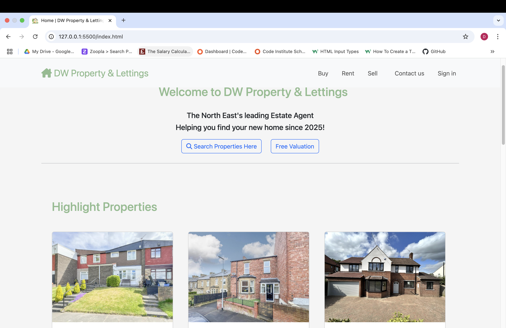
- The homepage has 3 main sections. The introduction at the top which contains the company name, along with some buttons for user friendliness.
- Underneath that comes the highlight properties section. These are top properties chosen by our professional team for showcase to prospective customers.
- Further down comes the new to market area, where properties again are shown in order of which they are added to the market. In the future this would update daily with the newest properties being shown.
- At the bottom of the page is our office locations. These are the 2 current locations of the company. In future I would use a google maps add on to show the locations.

### Contact us
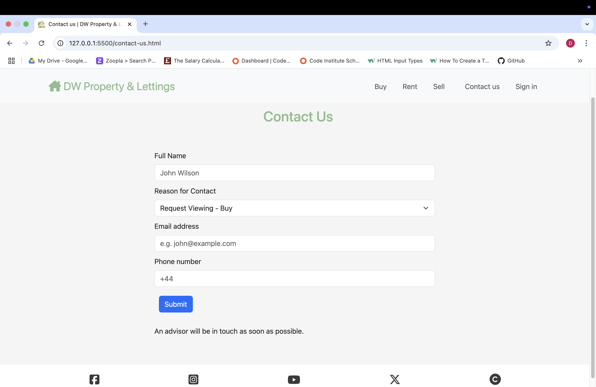
- The contact us page is set up for customers to query regarding house sales, and also request viewings for both purchase and let properties.
- The option for these three scenarios are provided in the drop down box along with all the other neccessary info needed.

### Home 1
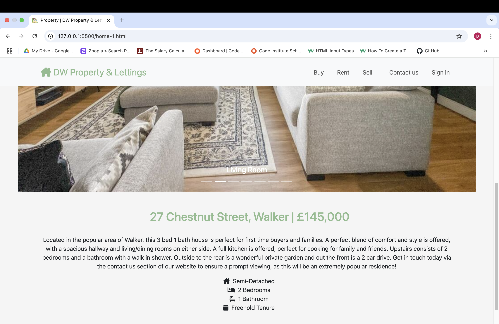
- This is the first showcase of a home for this page, it can be accessed by using the view property button on the homepage for any of the property cards. In future when these are all linked it would just be the corresponding property.
- This page contains a carousel of the images of the property with a description below and sales pitch for the home. Below this is some important information regarding the property.

## Design

### Colour Scheme
- The main colour scheme was white for the header and footer, and whitesmoke for the body of the pages.
- The main colour scheme for the text of the webpage was darkseagreen and black.
- These schemes offer contrasting shades so everything stands out in a professional design.

## Imagery

All images were sourced from rightmove, with random houses being used to protect the anonymity of real users.

## Technologies Used

### Development Tools
- Github: For hosting code through repositories and deployment.
- VS Code: Used for writing and testing local code prior to sending to github.
- HTML5: The standard language of a web page.
- CSS3: For styling the website.
- Bootstrap 5.3: To create responsive design and also some webpage features.
- Font Awesome: For adding all logos used on page.
- Favicon.io: For adding the favicon on the title bar of webpage.

## Deployment

### Deployment to GitHub Pages

This site has been deployed to GitHub pages. To view, please see below:

1. View the GitHub repository. This project is found at title (https://github.com/declanwatts97/code-institute-project-1)
2. You can view the deployment on github pages by visiting title(https://declanwatts97.github.io/code-institute-project-1/)

### Deployment Procedure

See below step by step instructions for how to deploy to GitHub pages:

1. Navigate to the GitHub repository, the link for this project is in the section above.
2. Scroll down to the Pages section in the left sidebar and then select.
3. Under Brach, you need to select the main branch and save.
4. After saving, GitHub will deploy your site. Refresh the page and you will see a link under the github pages section, linking you to your deployment.

## Testing
### Manual Testing
### User Stories Testing

1. The first thing tested to ensure user stories had been followed was requiring the webpage to be responsive and user friendly. This was tested by ensuring all screen sizes (phone,tablet, desktop) were catered for. I tested this through google developer tools and also on various devices of my own. This worked as expected.

2. The second thing tested was checking all images were of a required resolution to ensure the customer experience is of a high level. This was tested during the previous phase, ensuring that no image becomes pixelated during the testing on larger screens. This worked as expected.

3. The third thing tested was the sign in feature. This was tested by clicking the modal on all three pages and ensuring it is working correctly. This worked as expected.

4. The fourth thing tested was the contact us page. This was tested by ensuring the link to the page works and asking friends/family if all information they believe would be needed was a required field. This worked as expected.

5. The fifth thing tested was to run the code through a HTML validator and amend any issues. A errors and warnings with the code came back and these were then fixed. There are now no errors with the code on any three pages. Images are below.
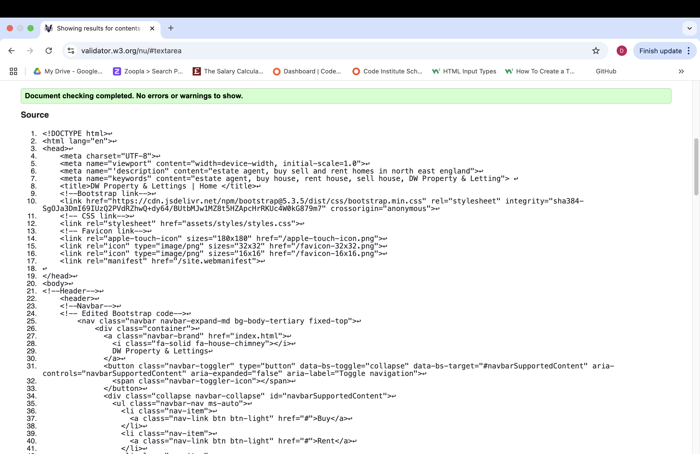
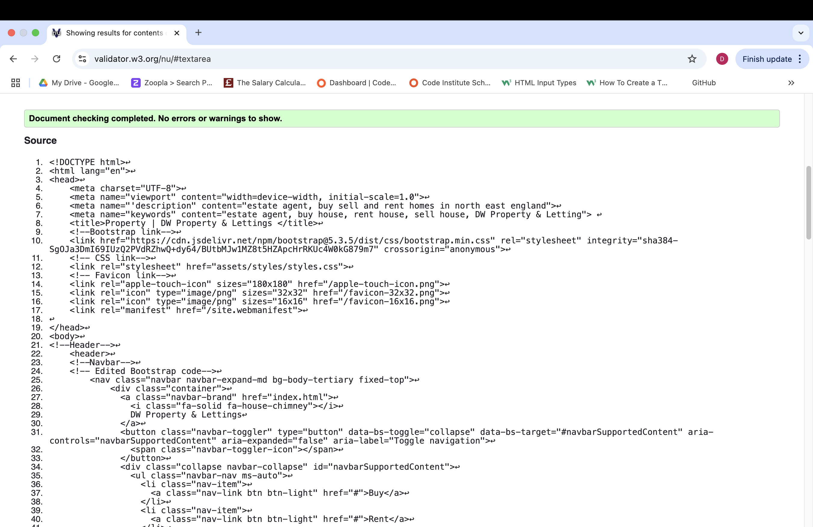
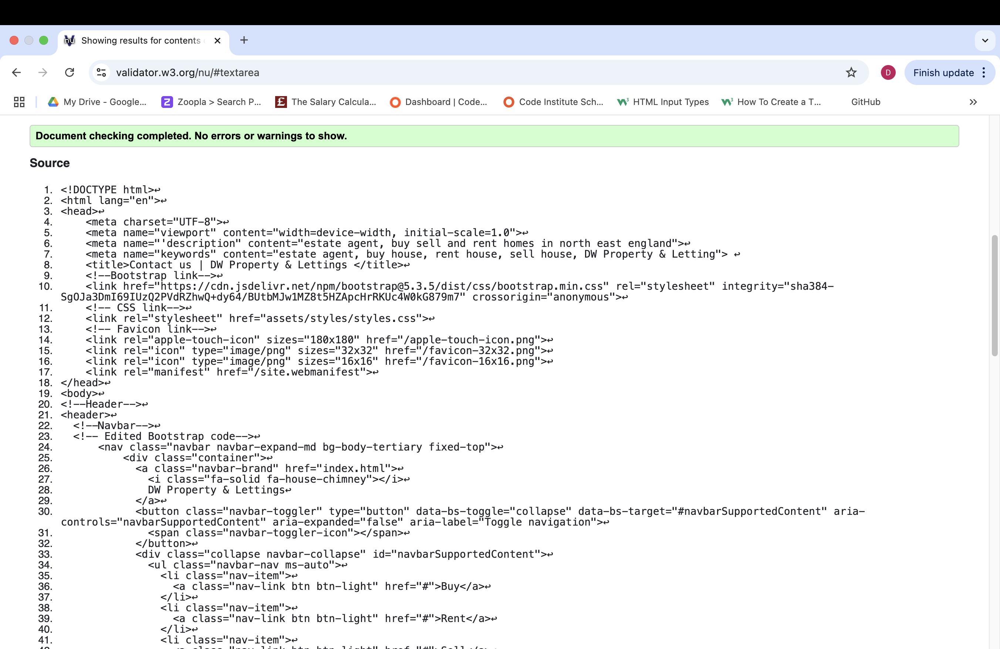

6. The sixth thing tested was to run the CSS through a CSS validator and amend any issues. No issues arose and it worked as expected. Images are below.
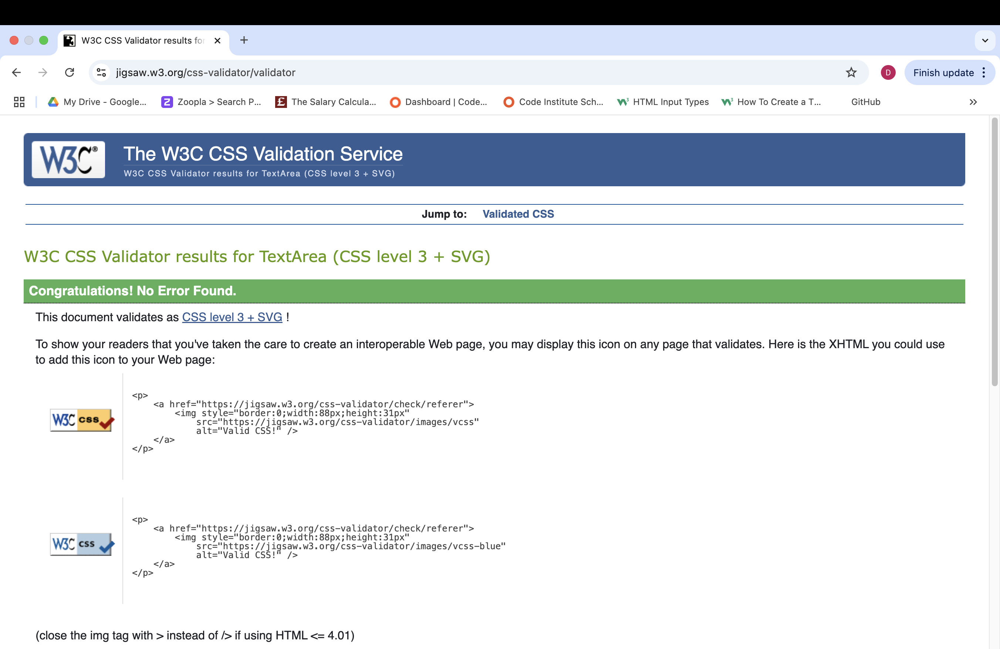

### User Testing

Below are the main testing points on the website:

1. Navbar - The navbar was tested by clicking on each navbar link and ensuring they function correctly. This test was successful as all navbar links lead to the appropriate pages.

2. Modal Funftionality - The modal was tested by clicking the login link in the navbar. This test was to ensure the sign in modal opens and contains the appropriate fields for input of info, email address/password.

3. View Property Button - The view property button on the cards featured on the home page were next to test. This test was to ensure they link to the correct property advert. All buttons currently lead to the same page as only one page is created at this point. This will be updated in the future when the rest of the pages have been created.

4. Contact Us - This test ensured that the contact us page works, containing the info needed for a customer to get in touch with the estate agent and book a viewing/property valuation. The form was checked to ensure the info requested was correct and the dropdown boxes work as they should. This passed the test without issue.

5. Footer - The social media links in the footer were the next to be tested. Each of these were clicked on to ensure that they did indeed link to the relevant social media platform. As the company doesn't have social media pages yet, this just links to the social media website homepage. This test passed without issue.

6. Webpage responsiveness - The next thing tested was the responsiveness of the webpage across various different screen sizes. This was tested in Google Chrome's developer tools, on the screen of my laptop and also my phone.

 - Laptop testing (Apple Macbook, also tested on Lenovo laptop) - The responsiveness was tested on my laptop screen. I concluded that the website was responsive and worked on the size of the laptop screen. Screenshots are below:

 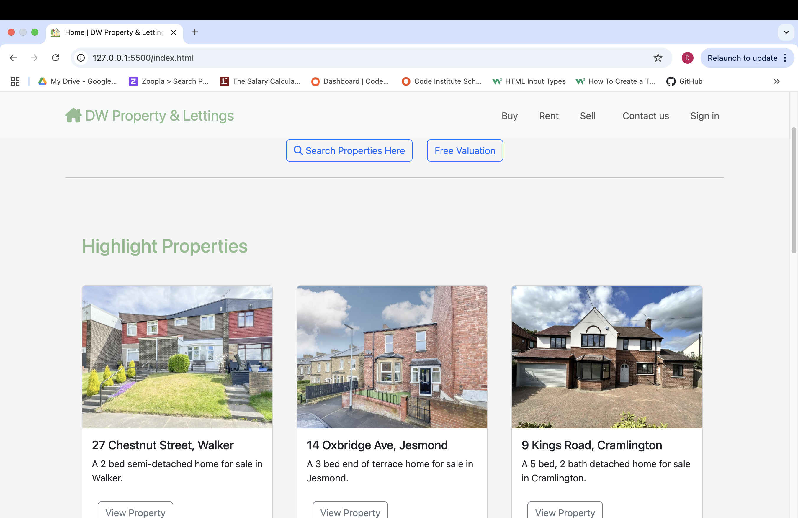

 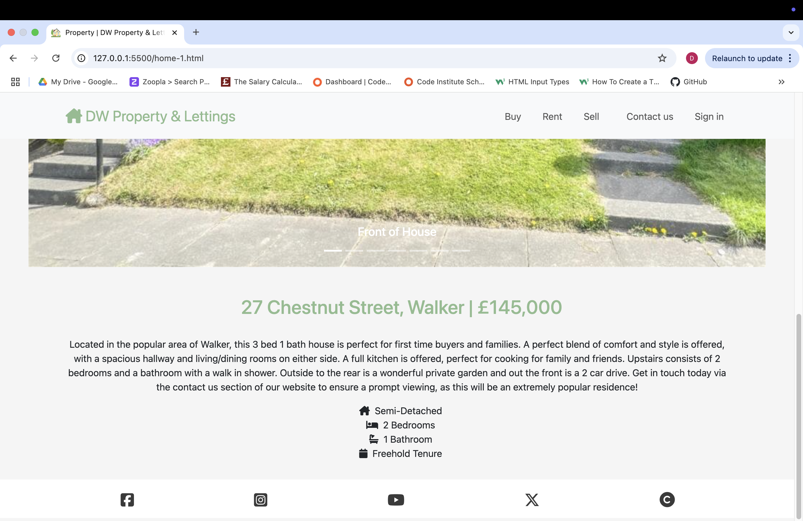
 
 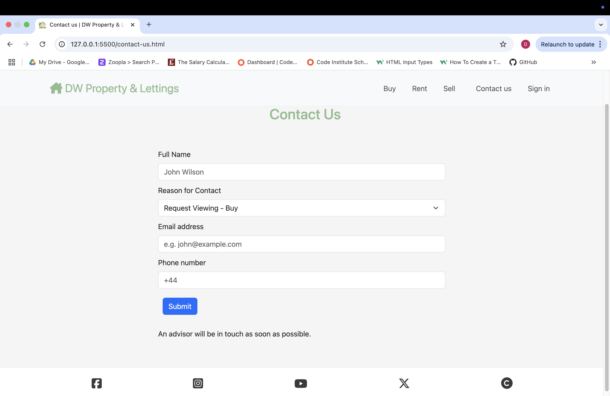
 
 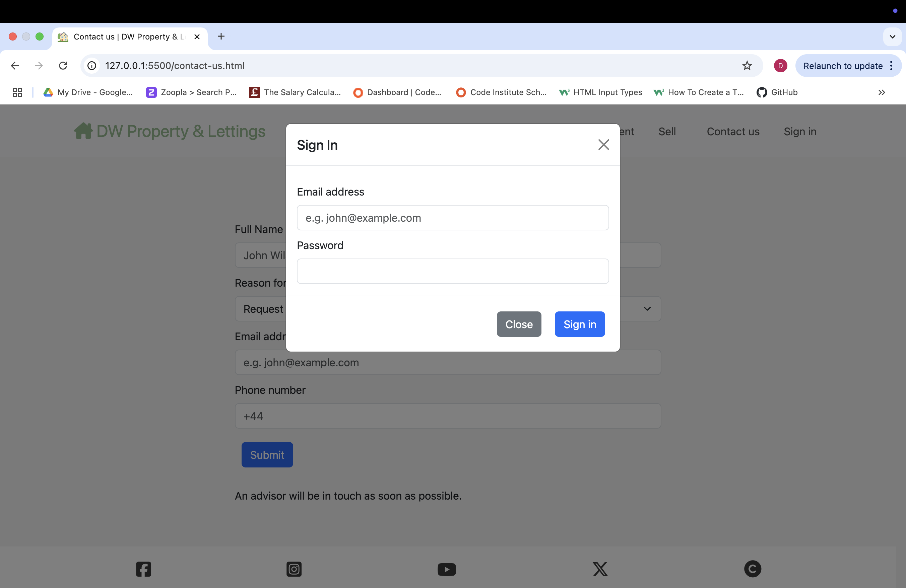

- Tablet testing (iPad Pro, also tested on Surface Pro 7 via developer tools) - The responsiveness for tablets was tested through Google Chrome's developer tools. I concluded that the site was responsive for tablets and looked as planned on the smaller screens. Screenshots are below:

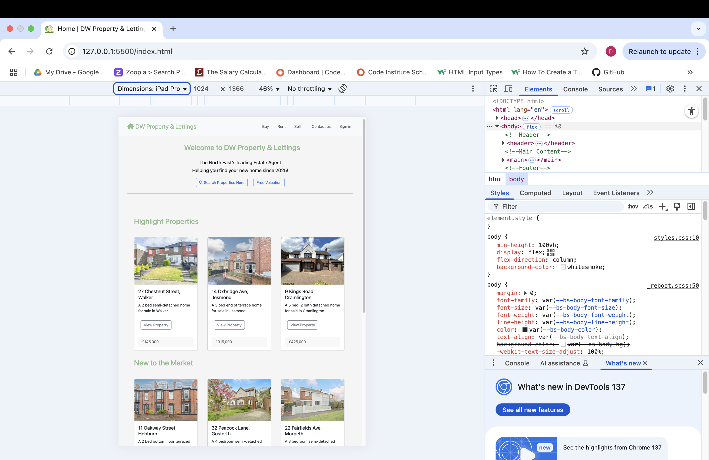

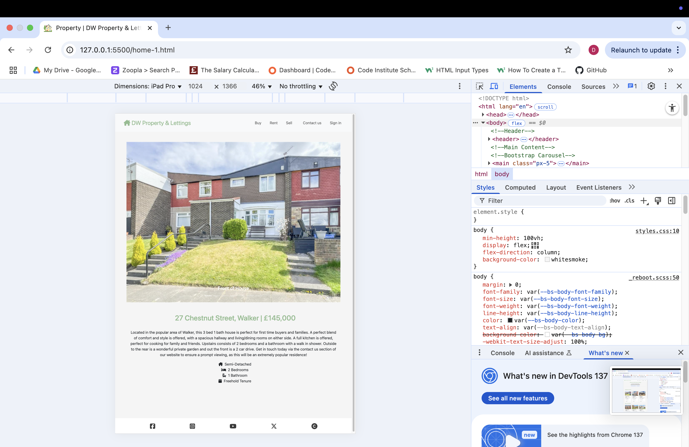

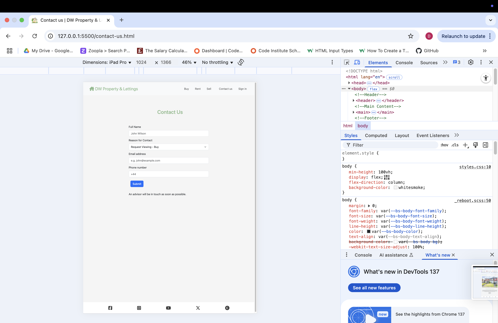

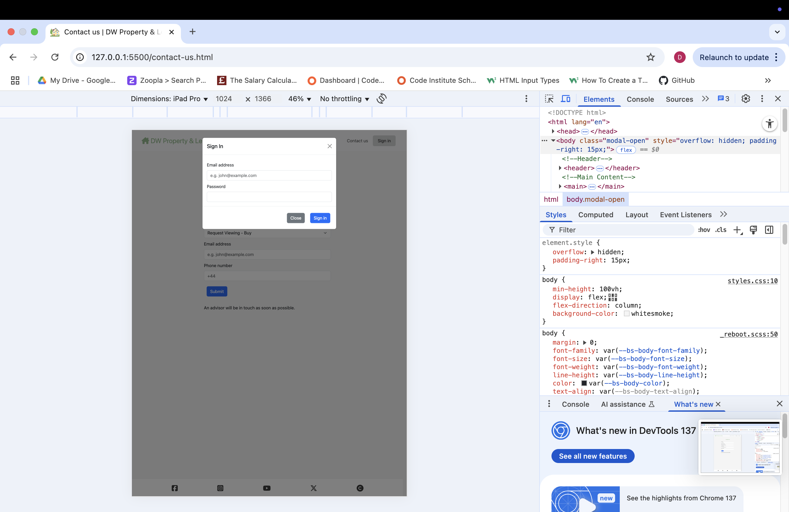

- Phone Testing (Apple iPhone 15, also tested on Samsung Galaxy S8 via developer tools) - The responsiveness for mobile phones was tested through accessing the deployment of the webpage on my phone. I concluded that the site was responsive for phones and looked as it should. Screenshots are below:

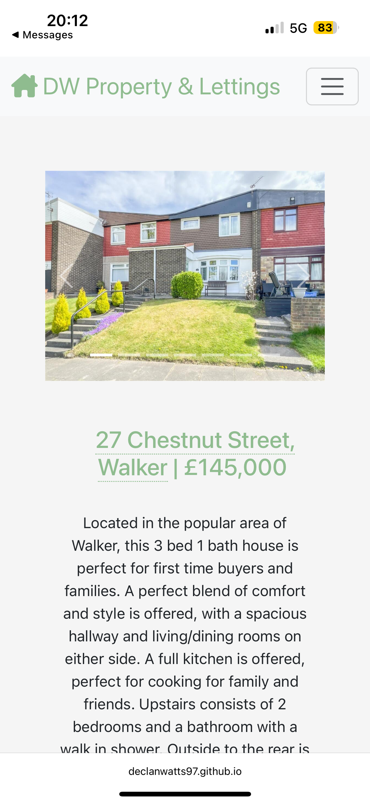

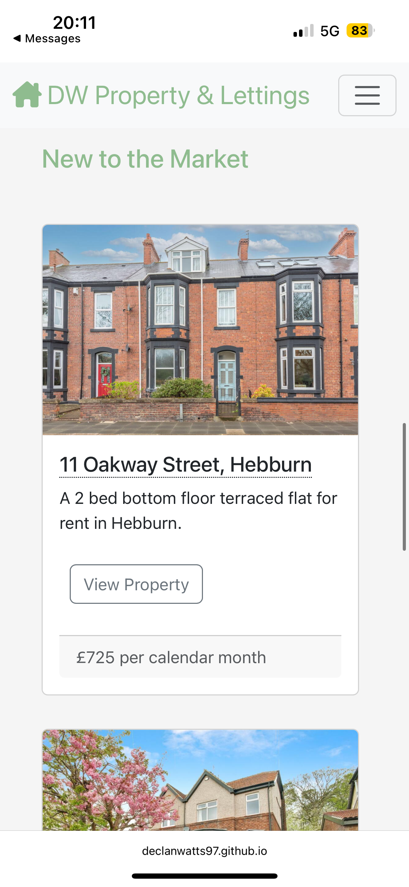

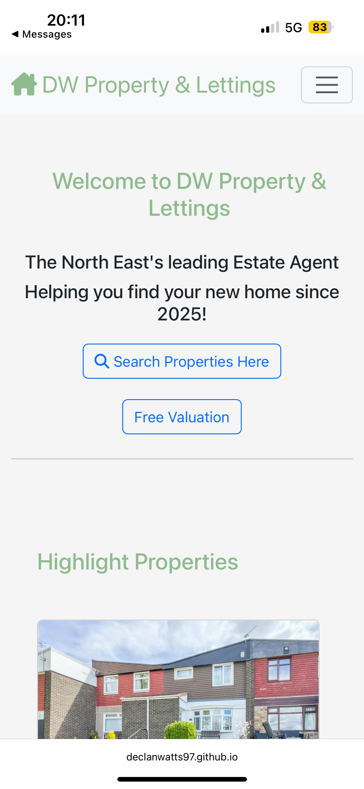

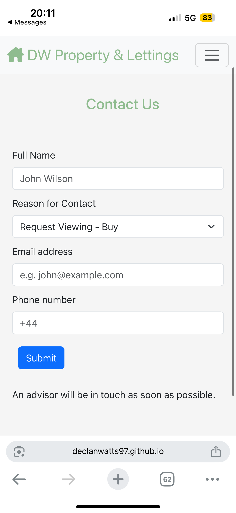

### Testing Summary

The above section detailing tests has confirmed that the website is fully operational and and user friendly, while also being responsive across devices.

### Browser Compatibility

This website was tested on the below browsers to ensure compatibility:

- Safari
- Google Chrome
- Microsoft Edge

## Credits
### Content and Inspiration
- Images: images taken from rightmove from random houses to ensure anonymity
- Content: ideas taken from various local estate agent websites

### Acknowledgements | All code used commented in html docs
- Bootstrap: for responsive design along with features such as cards and carousels.
- Font Awesome: for all icons used on the website
- Code Institute: for ideas and some code learnt in the love running project.
- Favicon.io - for the favicon used in browser title.

## Contact Information
- For any queries or feedback, please contact declan.watts97@gmail.com
